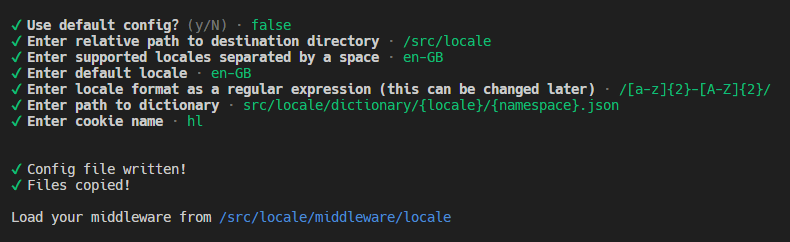

# **Next Loc**

A modern localisation solution for Next.js, featuring **Full TypeScript support**, **SSR support**, **easy setup & configuration**, **included middleware**, **global dictionaries & dictionary inheritance**, **compression**, and **translation deduplication**.

## Installation

Install Next Loc globally:

```bash
npm install -g next-loc
```

## Required Dependencies

Next Loc requires the following packages to be installed in your project directory:

- [`accept-language`](https://www.npmjs.com/package/accept-language)
- [`smob`](https://www.npmjs.com/package/smob)
- [`lz-string`](https://www.npmjs.com/package/lz-string) (can be changed, see [below](#compression))

## Basic Usage

### Configuration Setup

Configure Next Loc in your project:

```bash
npx next-loc@latest
```



#### **Options**

| Flag            | Alternative | Description                                           |
| --------------- | ----------- | ----------------------------------------------------- |
| `--default`     | `-d`        | Use the default configuration.                        |
| `--default-dir` | `-dd`       | Use the default destination directory (`src/locale`). |

_Made a mistake during configuration? Just run the command again to overwrite the existing configuration! **Be warned, this will overwrite any customisations you have made to destination directory, including the configuration file and middleware.**_

### Middleware

Next, import the generated middleware into your `middleware.ts` or `middleware.js` file. The included middleware is designed to be used as the only middleware in your project out-of-the-box, but can be freely modified to adapt to your middleware implementation. Refer to the [Next.js docs](https://nextjs.org/docs/app/building-your-application/routing/middleware) for more information. Here is an example implementation:

```ts
import { localeMiddleware } from "./path/to/middleware";

export const middleware = (request: NextRequest, _event: NextFetchEvent) => {
  return localeMiddleware(request, _event);
};

export const config = {
  matcher: "/((?!api|_next/static|_next/image|favicon.ico).*)",
};
```

### Dictionary Setup

Create a directory for each locale (with the same name), following the format described by the `dictionaryPath` option in the `config.ts` file.

Create a JSON file for each namespace (with the same name) within each locale directory, following the format described by the `dictionaryPath` option in the `config.ts` file.

For example, using the default configuration, the following dictionary files should be created:

- `src/locale/dictionary/en-GB/common.json`

### Routing

Move all routes into a `[locale]` directory, which allows the current locale to be determined using the URL params. See the [Next.js docs](https://nextjs.org/docs/app/building-your-application/routing/dynamic-routes) for more information.

### Context Setup

Wrap your app inside the `<LocaleContextProvider>` component at your app root, which allows you to access the current locale in client components via the use of the `useLocaleContext()` hook. See the [locale context documentation](#locale-context) for more information. You will also need to add a `<DictionaryContextProvider />` component at some point in the component tree, which allows you to access the current dictionary in heir client components via the use of the `useDictionaryContext()` hook. See the [dictionary context documentation](#dictionary-context) for more information.

### Localisation

#### **Using `translate(key, dictionary, locale)` _(not preferred)_**

- If no dictionary is provided, an empty dictionary will be used, thus all translations will not be found.
- If no locale is provided, the default locale will be used.
- `key` refers to the full **dot notation** path to the translation. For example, `"common.greetings.welcome"`, would be found at the `welcome` key, within the `greetings` object, within the JSON object in the `common.json` file.

```ts
// Usage with SSR

import { compileDictionary } from "./path/to/compileDictionary";

// Get locale from URL params

const dictionary = compileDictionary({
  locales: [locale],
  namespaces: ["common"],
});
const str = translate("common.greetings.welcome", dictionary, locale);
```

```ts
// Usage with client components

const { locale } = useLocaleContext();
const { dictionary } = useDictionaryContext();
const str = translate("common.greetings.welcome", dictionary, locale);
```

_See the [context documentation](#leveraging-context)_ for more information.

#### **Using `genT(locale, namespace, dictionary, options)` _(preferred)_**

- Returns a translate function
  - Default locale in the returned function is set to the value of `locale` here
  - The `key` is appended to the value of `namespace` here (`.` is added automatically)
  - The dictionary provided will be used by default in the returned function
  - All parameters can be overriden by passing them in the returned function (except from `key` which is **always** appended to the `namespace` here)
- If no dictionary is provided, an empty dictionary will be used, thus all translations will not be found.
- If no locale is provided, the default locale will be used.
- The `options` parameter is an optional object containing the following properties:
  - `delayDecompression?: boolean`: If `true`, the dictionary will not be decompressed in the generated function. It will instead be decompressed on each translation call.
  - `dedup?: boolean`: If `true`, the returned function will deduplicate translations. See [deduplication](#deduplication) for more information.

```ts
// Usage with SSR

const t = genT(locale, "common.greetings", dictionary);
const str = t("welcome");
```

```ts
// Usage with client components

const t = genT(locale, "common.greetings", dictionary);
const str = t("welcome");
```

#### **Using `useAutoGenT(namespace, options, override)` _(best)_**

`useAutoGenT` is a React Hook provided by Next Loc, which acts as a shorthand for `genT(locale, namespace, dictionary)`. It can be used in client components to prevent having to call `useLocaleContext()` and `useDictionaryContext()` to get the locale and dictionary. Instead, the locale and dictionary are retrieved from context within the hook itself. The `options` parameter is identical to that of `genT`. The `override` parameter is an optional object containing the following properties:

- `locale?: NextLocTypes.Locale`: Override the locale used in the hook
- `dictionary?: NextLocTypes.ThisDictionaryType`: Override the dictionary used in the hook

## Leveraging Context

### Locale Context

Next Loc includes a locale context provider to make it easier to access the current locale in client components. The recommended usage is to set the context at the app root.

```tsx
export default function RootLayout({
  children,
  params: { locale },
}: Readonly<{ children: React.ReactNode }> & NextLocTypes.LocaleParam) {
  return (
    <html lang={locale}>
      <body>
        <LocaleContextProvider {...{ locale }}>
          {children}
        </LocaleContextProvider>
        <LocaleLogProvider />
      </body>
    </html>
  );
}
```

Use `useLocaleContext()` to access the locale in client components.

```tsx
const { locale } = useLocaleContext();
```

### Dictionary Context

Next Loc includes a dictionary context provider to make it easier to access the current dictionary in client components. The recommended usage is to import the locales & namespaces you need (using `compileDictionary`) and use the context provider to expose the dictionary to any child components which require a certain part of the dictionary. This prevents having to pass the entire dictionary to context, instead only having what is needed available. Here is an exmaple:

```tsx
import { compileDictionary } from "./path/to/compileDictionary";

export const SSRComponent = ({
  children,
  params: { locale },
}: Readonly<{ children: React.ReactNode }> & NextLocTypes.LocaleParam) => {
  const dictionary = compileDictionary({
    locales: [locale],
    namespaces: ["common"],
  });

  return (
    <DictionaryContextProvider {...{ dictionary }}>
      {children}
    </DictionaryContextProvider>
  );
};
```

Use `useDictionaryContext()` to access the, now much smaller, dictionary in client components.

```tsx
const { dictionary } = useDictionaryContext();
```

For small sites, or sites where performance is not a concern, you may opt to include the entire dictionary in the app root, meaning that all localisations will be available to all components. For larger sites, you may consider creating additional dictionary contexts, for example, a global dictionary context, which might contain some commonly used translations. You will need to pass any non-default dictionaries to the override parameter of the `useAutoGenT` hook when using it.

```tsx
export default function RootLayout({
  children,
  params: { locale },
}: Readonly<{ children: React.ReactNode }> & NextLocTypes.LocaleParam) {
  const dictionary = compileDictionary({
    // you may also pass `localeConfig.supported.locales` here if you want to include all supported locales
    locales: [locale],
    namespaces: [
      ...localeConfig.supported.namespaces,
      ...localeConfig.supported.globalNamespaces,
    ],
  });

  return (
    <html lang={locale}>
      <body>
        <LocaleContextProvider {...{ locale }}>
          <DictionaryContextProvider {...{ dictionary }}>
            {children}
          </DictionaryContextProvider>
        </LocaleContextProvider>
        <LocaleLogProvider />
      </body>
    </html>
  );
}
```

### Translate Function

Next Loc also includes a context provider for the `translate` function. This allows you to create a translate function using `genT`, then pass it to the `<TranslationContextProvider />` component, then use `useTranslationContext()` to access the translate function in client components.

```tsx
export const Component = () => {
  const t = genT(locale, "common.greetings", dictionary);
  // OR `const t = useAutoGenT("common.greetings");` if client-side

  return (
    <TranslationContextProvider translator={t}>
      <ChildComponent />
    </TranslationContextProvider>
  );
};
```

```tsx
// Child (client) component

export const ChildComponent = () => {
  const { translator: t } = useTranslationContext();

  return <p>{t("welcome")}</p>;
};
```

## Log Errors & Warnings

Next Loc makes some checks to ensure that localisation will function as expected (these can be inspected in `internal/checks.ts`). To enable these checks, add the `<LocaleLogProvider />` component at the app root.

These checks cover:

- Checking that all supported locales satisfy the `localePattern` specified in the `config.ts` file
- Checking that the default locale is included as a supported locale

## Configuration File

Next Loc generates a configuration file, `config.ts` within the destination directory. This file can be freely modified to suit your needs. This is the default configuration that is generated with the default options during setup:

```ts
{
  supportedLocales: ["en-GB"],
  supportedNamespaces: ["common"],
  globalNamespaces: [],
  defaultLocale: "en-GB",
  defaultNamespace: "common",
  cookieName: "hl",
  localePattern: /[a-z]{2}-[A-Z]{2}/,
  dictionaryPath: "src/locale/dictionary/{locale}/{namespace}.json",
  inherits: {},
  ignoreMiddleware: [
    "/static",
    "/api",
    "/_next",
    "favicon.ico",
    "robots.txt",
    "sitemap.xml",
  ],
  suppress: {
    missingDictionary: false,
    localeSatisfiesPattern: false,
    defaultLocaleIsSupported: false,
  },
  optOutCompression: false,
}
```

**`supportedLocales`**

A string array, containing the locales supported by your application.

**`supportedNamespaces`**

A string array, containing the namespaces supported by your application. Each namespace corresponds to an indiviual JSON file located inside each dictionary directory.

**`globalNamespaces`**

A string array, containing the namespaces found in the `GLOBAL` directory, available for all locales.

**`defaultLocale`**

The default locale, used when no cookie is set, and the request URL contains no supported locale.

**`defaultNamespace`**

The namespace used for finding localisations when no namespace is provided to the translator function.

**`cookieName`**

The name of the cookie used to store the selected locale in the user's browser.

**`localePattern`**

The pattern for supported locales. This is used when the request URL does not contain a supported locale, to determine if the user is trying to access a valid, but not supported locale. For example, using the default configuration, the URL `/de-DE/page` would be redirected to `en-GB/page`, because `de-DE` satisfies the `localePattern`. Whereas the URL `something/page` would be redirected to `en-GB/something/page`, because `something` does not satisfy the `localePattern`.

**`dictionaryPath`**

The path to the JSON dictionary files. This should include `{locale}` and `{namespace}` to point to the correct files for each locale and namespace during dictionary compilation. See [Using Non-JSON Dictionaries](#using-non-json-dictionaries) below for more information.

**`inherits`**

Declare dictionary inheritance, in the format `{ {locale}: {other locales}[], ... }`. See [inheritance](#inheritance) below for more information.

**`ignoreMiddleware`**

An array of paths for which the middleware will return an unmodified response. This is useful for ignoring static files which should not differ based on locale, such as `/favicon.ico`. Middleware execution can be prevented via the `config` object within `middleware.ts`, as referenced by the [Next.js docs](https://nextjs.org/docs/app/building-your-application/routing/middleware#matching-paths). Paths in `ignoreMiddleware` will **NOT** prevent middleware from being executed.

**`suppress`**

Allows you to suppress certain errors.

- `missingDictionary`: If `true`, no errors will be shown when a dictionary is missing. If an _array containing locales_ is provided, only errors for those locales will be suppressed.
- `localeSatisfiesPattern`: If `true`, no errors will be shown when a locale does not satisfy the `localePattern` specified in the `config.ts` file.
- `defaultLocaleIsSupported`: If `true`, no error will be shown when the default locale is not included as a supported locale.

**`optOutCompression`**

If `true`, Next Loc will not compress the dictionary object. See the [section on compression](#compression) below for more information.

## Inheritance & Global Dictionaries

### Inheritance

Next Loc provides a property in the config object, `inherits`, which allows locales to inherit translations from other locales. This is useful for implementing locales for different cultures within the same language. For example, if your site has the locale `en-GB`, but you also want to support the locale `en-US`, instead of copying every file from the `en-GB` directory, you can simply add the following to the `config.ts` file:

```ts
inherits: {
  "en-US": ["en-GB"]
}
```

This means that every localisation from `en-GB` is inherited by `en-US`. From here, you can add unique translations to `en-US` as normal, and they will overwrite the translations inherited from `en-GB`. To prevent errors due to missing dictionary files for `en-US`, make sure to set `suppress.missingDictionary` to `true`, or include `en-US` in its array.

### Global Dictionaries

Next Loc also provides support for global dictionaries. A global dictionary is, in essence, "inherited" by **ALL** locales. To use global dictionaries, create a `GLOBAL` directory **in the same** directory as the normal locales. Within this `GLOBAL` directory, create a JSON file for each member of `globalNamespaces` in `config.ts`. Translations located in global dictionaries are accessed in the same way as regular localisations. For example, if there is a file `GLOBAL/metadata.json`, its translations can be accessed as follows.

```tsx
//...

<p>{translate("metadata.site.title", locale, dictionary)}</p>

//...
```

### Priority

Dictionaries are compiled in the following order:

- Global dictionaries
- Inherited dictionaries (overwrite global dictionaries)
  - Inherited locales are compiled in the order in which they are listed in `inherits` property
- Regular dictionaries

For example, if `en-US` inherits from `["en-GB", "en-CA"]`, and the application makes use of global dictionaries, the global dictionaries will be compiled first, then merged with the inherited dictionaries, first `en-GB`, then `en-CA`, any conflicts being overwritten by the inherited dictionaries in the order of their declaration (`en-CA` overwrites conflicts with `en-GB`), then the regular dictionaries for `en-US` will be compiled last, any conflicts being overwritten by the regular dictionaries.

## Compression

Next Loc includes support for compressing the dictionary object. The default and recommended compression method is achieved via the use of [lz-string](https://www.npmjs.com/package/lz-string). To change the compression (and decompression) functions, modify the `compressFunction` and `decompressFunction` functions exported from `internal/compression.ts`. For small sites with a small amount of text, or a small number of locales, you should consider opting out of compression to improve performance.

## Deduplication

Next Loc includes support for deduplication of translations. This can be achieved by setting the `dedup` option in a `genT` or `useAutoGenT` call to `true`. This will ensure that for any usage of the returned translator function, only one translation will be computed from the dictionary, and all future calls with the same key will return a copy of the first translation. Here is an example:

```tsx
export const Component = ({ someData }: { someData: Data[] }) => {
  const t = useAutoGenT("common.greetings", { dedup: true });

  return (
    <div>
      {someData.map((dataPoint) => {
        return <div key={dataPoint.id}>{t("welcome")}</div>;
      })}
    </div>
  );
};
```

In the above example, the translation for `common.greetings.welcome` will only be computed once, each subsequent call to `t("welcome")` will return a copy of the first translation.

## Using Non-JSON Dictionaries

Next Loc currently does not have out-of-the-box support for non-JSON dictionaries. You may be able to achieve this functionality by doing the following:

- Modify the `dictionaryPath` option in the configuration file, to use the necessary file extension.
- Modify the `compileDictionary` function in `internal/compileDictionary.ts`,
  - Change `JSON.parse(fileContents)` to a custom function
  - The function must parse the format of your dictionary file, and return a JSON object
